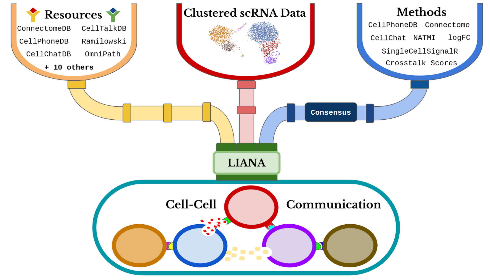

# Bioinformatic Tools

Here we list number of packages that are useful for different aspects of the data analysis process for bioinformatics datasets.

## Table of Contents

- [Bioinformatic Tools](#bioinformatic-tools)
  - [Table of Contents](#table-of-contents)
  - [Data modelling and differential abundance](#data-modelling-and-differential-abundance)
    - [Model selection](#model-selection)
    - [Linear models](#linear-models)
    - [Linear mixed effect models](#linear-mixed-effect-models)
    - [Spline models](#spline-models)
  - [Pathway analysis](#pathway-analysis)
    - [Gene set enrichment](#gene-set-enrichment)
    - [Functional enrichment network](#functional-enrichment-network)
  - [Cell deconvolution](#cell-deconvolution)
  - [Ligand-receptor pairs](#ligand-receptor-pairs)
  - [Co-expression networks](#co-expression-networks)
  - [Data visualisation](#data-visualisation)
  - [Machine learning](#machine-learning)

## Data modelling and differential abundance

### Model selection

Often we will be interested in testing multiple models to determine which offers the best fit, maximising the total variance explained while minimising the risk of overfitting. Common metrics of these are [Akaike's Information Criterion](https://en.wikipedia.org/wiki/Akaike_information_criterion) (AIC or AICc for low sample size), [Bayesian Information Criterion](https://en.wikipedia.org/wiki/Bayesian_information_criterion) (BIC), and [Deviance Information Criterion](https://en.wikipedia.org/wiki/Deviance_information_criterion) (DIC; especially useful when model posterior distributions have been obtained by Markov Chain Monte Carlo (MCMC) simulation). One explanation of the differences in metrics can be viewed [here](https://studystics1.medium.com/odyssey-of-a-data-scientist-information-criteria-aic-bic-dic-waic-both-r-and-python-code-d11a4ac1c0be).

* **[MuMIn](https://rdrr.io/cran/MuMIn/man/MuMIn-package.html)**: MuMIn stands for "multi-model inference". This package offers functions to streamline the information-theoretical model selection process and carry out model averaging based on information criteria. A particularly useful element is the [`dredge`](https://rdrr.io/cran/MuMIn/man/dredge.html) function, which generates a model selection table with combinations (subsets) of fixed effect terms in a global model, with optimal model inclusion rules (can use multiple metrics to choose the best model, such as AIC, AICc, BIC etc.). This is particularly useful when determining which elements to retain for your models. It works with a range of [fitted models](https://rdrr.io/cran/MuMIn/man/supported-classes.html), but requires a work-around for models that don't store the model call in their outputs (via a wrapper function created by [`updateable`](https://rdrr.io/cran/MuMIn/man/updateable.html)).

### Linear models

* **[MaAsLin2](https://huttenhower.sph.harvard.edu/maaslin/)**: a package for efficiently determining multivariable association between phenotypes, environments, exposures, covariates and microbial meta’omic features. MaAsLin2 relies on general linear models to accommodate most modern epidemiological study designs, including cross-sectional and longitudinal, and offers a variety of data exploration, normalization, and transformation methods. This tool was specifically designed for use with microbiome data, but can be influenced heavily by outliers.

* **[LIMMA](https://kasperdanielhansen.github.io/genbioconductor/html/limma.html)**: LIMMA stands for "linear models for microarray data". Although originally developed for RNAseq microarray data, it is also particularly good at identifying differential abundance in normalised microbiome and metabolomics/lipidomics datasets. We also provide a convenient wrapper around this function for phyloseq objects (called `phyloseq_limma`) [here](https://github.com/mucosal-immunology-lab/microbiome-analysis).

### Linear mixed effect models

These models, abbreviated as LMM models, offer an extension to simple linear models and allow both fixed and random effects. They are particularly useful when there is non-independence in the data, such that there is some hierarchical structure to the data. For example, mice could be considered per cage, or individual patients in a longitudinal study where multiple samples are collected from the same individual over time (they act as their own control group).

* **[lmerTest](https://rdrr.io/cran/lmerTest/man/lmerTest-package.html)**: The lmerTest package extends the [lme4](https://rdrr.io/cran/lme4/) package, and provides p-values in type I, II or III anova and summary tables for linear mixed models (lmer model fits via lme4) via Satterthwaite's degrees of freedom method; a Kenward-Roger method is also available via the pbkrtest package. Model selection and assessment methods include step, drop1, anova-like tables for random effects (ranova), least-square means (LS-means; ls_means) and tests of linear contrasts of fixed effects (contest). 

* **[MCMCglmm](https://www.rdocumentation.org/packages/MCMCglmm)**: This package offers a Bayesian approach to fitting Multivariate Generalised Linear Mixed Models (and related models) using Markov chain Monte Carlo techniques. Some tutorials for this package can be found here: 
  * Course notes from the package author ([here](https://mran.microsoft.com/snapshot/2018-08-24/web/packages/MCMCglmm/vignettes/CourseNotes.pdf)).
  * Intro to the MCMCglmm package for biologists ([here](https://ourcodingclub.github.io/tutorials/mcmcglmm/)).

* **[glmmSeq](https://rdrr.io/cran/glmmSeq/)**: Uses mixed effects models to analyse longitudinal gene expression and highlight differences between sample groups over time. This package provides negative binomial and Gaussian mixed effects models to fit gene expression and other biological data across repeated samples (example manuscript [here](https://www.nature.com/articles/s41591-022-01789-0)). This fills a gap in many other differential gene expression tools that are unable to fit linear mixed models, and are less optimal for analysis of longitudinal data.

### Spline models

* **[MetaLonDA](https://github.com/aametwally/MetaLonDA)**: MetaLonDA stands for "metagenomic longitudinal differential abundance method". It identifies the significant time intervals of microbial features in longitudinal studies, and is able to handle common inconsistencies such as variable sample collection times and uneven number of time points along the subjects' longitudinal study. It employs a negative binomial distribution in conjunction with a semi-parametric SS-ANOVA to model the read counts and performs significance testing based on unit time intervals in a permutational manner. 

## Pathway analysis

### Gene set enrichment

* **[QuSAGE](https://rdrr.io/bioc/qusage/)**: QuSAGE stands for "quantitative set analysis for gene expression", and is a novel gene set enrichment-type test. It is designed to provide faster, more accurate, and easier to understand test for gene expression studies. QuSAGE accounts for inter-gene correlations using a [variance inflation factor](https://en.wikipedia.org/wiki/Variance_inflation_factor) technique, a quantifies gene set activity with a complete [probability density function](https://en.wikipedia.org/wiki/Probability_density_function) (from which p-values and confidence intervals are easily extracted). The package also includes a mixed-effects model implementation and meta-analysis framework. An introduction and examples can be found [here](https://rdrr.io/bioc/qusage/f/inst/doc/qusage.pdf).

### Functional enrichment network

* **[clusterProfiler](https://rdrr.io/bioc/clusterProfiler/)**: This package implements methods to analyse and visualise functional profiles (GO and KEGG) of gene and gene clusters. It is discussed along with [enrichplot](https://rdrr.io/bioc/enrichplot/) in a guide by the author [here](https://yulab-smu.top/biomedical-knowledge-mining-book/index.html).

## Cell deconvolution

* **[Bisque](https://rdrr.io/github/cozygene/bisque/)**: This package provides tools to estimate cell type abundances from heterogenous bulk RNA expression datasets. A reference-based method utilizes single-cell information to generate a signature matrix and transformation of bulk expression for accurate regression based estimates. A marker-based method utilizes known cell-specific marker genes to measure relative abundances across samples. Its performance is benchmarked in a paper found [here](https://www.nature.com/articles/s41467-020-19015-1), and it can be downloaded from the authors' [GitHub page](https://github.com/cozygene/bisque/).

## Ligand-receptor pairs

A review and comparison of current methods and resources for cell-cell communication inference from single-cell RNASeq data can be found [here](https://www.nature.com/articles/s41467-022-30755-0).

* **[CellChat](https://rdrr.io/github/sqjin/CellChat/)**: This tool attempts to infer, visualise, and analyse cell-cell communication networks from scRNASeq and spatial imaging data.

* **[LIANA](https://rdrr.io/github/saezlab/liana/)**: This tool enables the use of any combination of ligand-receptor methods and resources, and their consensus (i.e. the determined average of up to all 7 methods). It is the tool proposed in the [review](https://www.nature.com/articles/s41467-022-30755-0) above. The tools it combines are [CellPhoneDBv2](https://github.com/Teichlab/cellphonedb), [CellChat](https://github.com/sqjin/CellChat), [NATMI](https://github.com/forrest-lab/NATMI), [Connectome](https://github.com/msraredon/Connectome), [SingleCellSignalR](https://github.com/SCA-IRCM/SingleCellSignalR), [iTALK](https://github.com/Coolgenome/iTALK)-inspired 1-vs-rest logFC score, [CytoTalk](https://advances.sciencemag.org/content/7/16/eabf1356)-inspired cross-talk scores, and the `consensus_rank` of the prediction is provided using the `RobustRankAggregate` method. In essence, LIANA decouples the respective methods from their resources, and allows a combination to harness the power of each, but also aims to mitigate the differences between resources to provide a consensus score. A tutorial can be found [here](https://saezlab.github.io/liana/articles/liana_tutorial.html). 

## Co-expression networks

* **[WGCNA](https://horvath.genetics.ucla.edu/html/CoexpressionNetwork/Rpackages/WGCNA/)**: WGCNA stands for "weight gene co-expression network analysis". Weighted correlation network analysis can be used for finding clusters (modules) of highly-correlated genes. This package provides functions for network construction, module detection, gene selection, calculations of topological properties, data simulation, visualisation, and interfacing with external software. A comprehensive set of tutorials can be found on the package website.

* **[MEGENA](https://rdrr.io/cran/MEGENA/)**: MEGENA stands for "multiscale embedded gene co-expression network analysis". It can effectively and efficiently construct and analyse large-scale planar filtered co-expression networks. Embedded network construction can be run in parallel, and it can identify multi-scale clustering structures. It showed some improvement over WGCNA in the released [manuscript](https://journals.plos.org/ploscompbiol/article?id=10.1371/journal.pcbi.1004574). A small tutorial can be found [here](https://rpubs.com/grrompala/656670), in addition to the one found in the vignette [here](https://cran.r-project.org/web/packages/MEGENA/vignettes/MEGENA_pipeline_10062016.html).

## Data visualisation

* **[volcano3D](https://rdrr.io/cran/volcano3D/)**: Generates interactive plots for analysing and visualising three-class high dimensional data - it is particularly suited to visualising differences in continuous attributes such as gene/protein/biomarker expression levels between three groups. It can produce 3-way polar plots for easier interpretation of three-class data following prior differential abundance analysis testing (example below). An example of a 2x3 study design (responders and non-responders to 3 distinct drugs) is provided [here](https://katrionagoldmann.github.io/volcano3D/articles/Vignette_2x3.html). 

## Machine learning

* **[caret](https://rdrr.io/cran/caret/)**: caret stands for "classification and regression training", and is a set of functions that attempt to streamline the process for creating predictive models. It can assist with essentially every step of the machine learning process, right from pre-processing and model training and tuning (access to 238 different ML models as of August 2022) right through to comparison of different model performance, variable importance, and feature selection. A great tutorial from the author can be found [here](http://topepo.github.io/caret/index.html).